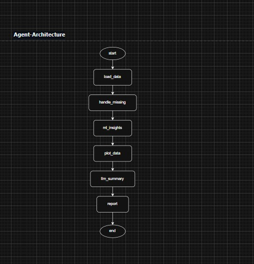

# Conversational AI Data Analyst 🤖📊

A dataset-agnostic AI system that performs:
- Automatic EDA
- Intelligent ML task & target inference
- Classification & regression modeling
- LLM-powered business insights
- FastAPI backend + Streamlit frontend

An advanced, production-ready AI Agent system built with **LangGraph** for stateful orchestration, **FastAPI** for a robust backend, and **Groq LLMs** for high-speed inference.


## 🚀 Features
- Upload **any CSV dataset**
- Auto-detects:
  - Classification vs Regression
  - Target variable
- Handles:
  - Categorical encoding
  - Class imbalance
  - ROC-AUC / RMSE metrics
- Generates:
  - Plots
  - Feature importance
  - Business-style summaries using LLMs

## 🏗️ Architecture



## Start backend
```bash
uvicorn app:api --reload
```
## Start frontend
```bash
streamlit run frontend.py
```
## clone repo
```bash
git clone https://github.com/MedisettiVinay0519/Conversational-AI-Data-Analyst.git
```

### 1️⃣ Install dependencies
```bash
pip install -r requirements.txt
```
